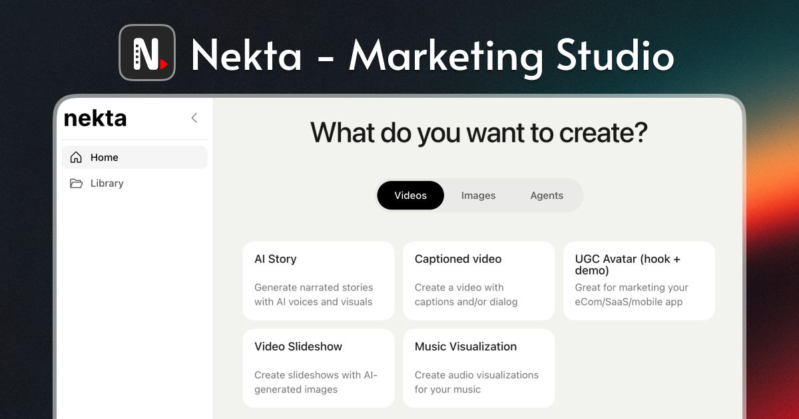

# Nekta AI Marketing Studio

Nekta Marketing Studio is desktop app that creates short videos to promote your apps, products, music, and more. 100% free and open source. Works fully offline (unless you use AI for content generation) and includes built-in assets to get started right away.

## Download

- [Download for MacOS](https://api.nekta-studio.com/api/v1/downloads/macos)
- [Download for Windows](https://api.nekta-studio.com/api/v1/downloads/windows)
- [Download for Linux](https://api.nekta-studio.com/api/v1/downloads/linux)

## Quick Setup (Development)

```sh
# install dependencies
npm install

# run app in development
npm run dev

# build for current platform
npm run build
```

## Templates

### 1. AI Story

Create AI-narrated videos with generated voiceover, images, and story. You can use AI to generate the entire content or input everything manually.

Choose from 17 art styles (Ghibli, Anime, Cyberpunk, etc.) and multiple AI voices.

<p align="center">
  
  
</p>

[Full documentation](https://docs.nekta-studio.com/ai-video)

---

### 2. Captioned Video

Create videos with voiceovers and synchronized captions over a playing video. Great for brainrot-style content or educational videos. Includes built-in background videos or upload your own.

<p align="center">
  
  
</p>

[Full documentation](https://docs.nekta-studio.com/captioned-video)

---

### 3. UGC Avatar

Create UGC-style videos with a hook featuring an AI avatar, followed by your product demo. Perfect for promoting SaaS products, mobile apps, and e-commerce stores. Includes built-in AI UGC avatars.

<p align="center">
  
</p>

[Full documentation](https://docs.nekta-studio.com/ugc-avatar)

---

### 4. Slideshow

Create slideshow videos with images and text captions. Upload your own images or generate them with AI. Customize overlay colors, caption styles, and slide duration.

<p align="center">
  
</p>

[Full documentation](https://docs.nekta-studio.com/slideshow)

---

### 5. Music Visualization

Create audio visualizations for your music. Choose from 3 layout styles (big cover, rotating vinyl, rotating disk) and 10 waveform types. Great for promoting songs, podcasts, or any audio content.

<p align="center">
  
  

  
  
</p>

[Full documentation](https://docs.nekta-studio.com/music-video)

---

## Library

All rendered videos are stored in the Library. Play, preview, download, or delete your videos from there.

[Full documentation](https://docs.nekta-studio.com/library)

---

## AI Providers

To use AI features (image/video generation, voiceover), you'll need API keys from one or more providers:

| Provider        | Used For                              | Docs                                                  |
| --------------- | ------------------------------------- | ----------------------------------------------------- |
| **OpenAI**      | Text generation, images, voiceover    | [Setup guide](https://docs.nekta-studio.com/openai)   |
| **Together.AI** | Image/video generation, transcription | [Setup guide](https://docs.nekta-studio.com/together) |

---

## License

AGPL-3.0-only
